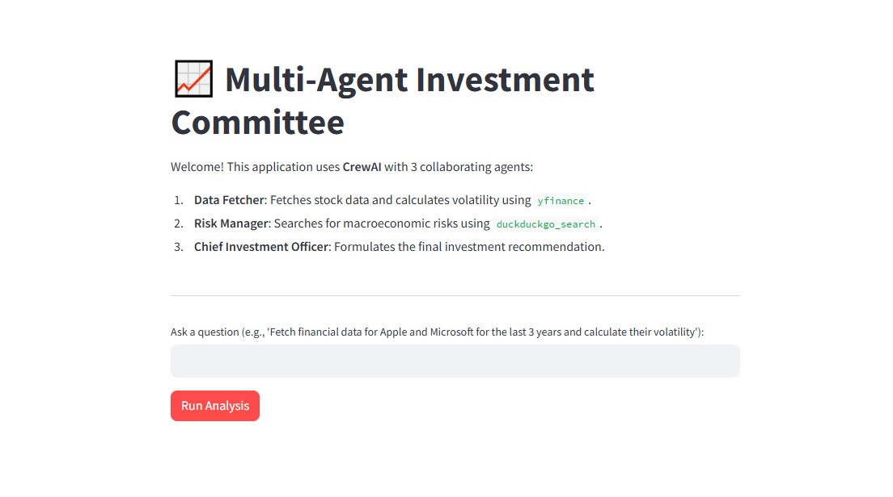

# Multi-Agent Investment Committee (CrewAI)



## 🎯 Project Goal
The primary objective of this project was to automate financial research and risk assessment using a multi-agent AI system. 

Unlike standard chat interfaces, this application utilizes **CrewAI** to delegate specific tasks to specialized agents. It allows stakeholders to:
- **Gather Data Efficiently**: Retrieve multi-year historical stock data and calculate market volatility automatically.
- **Assess Macroeconomic Risks**: Scrape the latest internet news for sectoral risks rather than relying solely on numbers.
- **Synthesize Information**: Let a "Chief Investment Officer" agent analyze both the hard data and the risk reports to provide a final, actionable investment recommendation (Buy/Hold/Sell).

## 💻 Technologies & Tools
- **CrewAI** – Main framework used to orchestrate AI agents and manage task delegation.
- **Streamlit** – Used for building a clean, interactive web frontend for the system.
- **yfinance** – Python library used as a Custom Tool by the Data Fetcher agent to scrape Yahoo Finance.
- **DuckDuckGo Search** – Free web search API used by the Risk Manager agent to look for recent news.
- **Google Gemini (flash)** – The underlying native LLM powering the agents' reasoning and decision-making capabilities.

## 📊 Key Features & Architecture


- **Agent 1 (Junior Analyst)** 
  - **The Insight**: Equipped with a custom `fetch_stock_data` tool, this agent retrieves historical close prices and calculates the annualized volatility. 
  - **Business Value**: Automates the initial quantitative research phase, saving human analysts hours of manual data collection.

- **Agent 2 (Risk Manager)** 
  - **The Insight**: Uses internet search tools to find "threats" related to the requested companies or sectors. 
  - **Business Value**: Provides necessary qualitative context. Even if a stock's volatility is low, this agent might flag a pending lawsuit or a macroeconomic shift that changes the outlook.

- **Agent 3 (Chief Investment Officer)** 
  - **The Insight**: Reviews the outputs of the previous two agents in sequence. 
  - **Business Value**: Delivers the final investment verdict in Markdown, allowing users to make data-driven decisions backed by both numbers and recent news.

## 📂 Project Structure
The repository is organized as follows:
- `images/` - Folder containing screenshots used in this documentation (e.g., application UI, architecture).
- `app.py` - The Streamlit frontend application.
- `main.py` - Core logic containing the CrewAI definitions (Agents, Tasks, Tools).
- `requirements.txt` - File containing all necessary Python dependencies.
- `README.md` - Project documentation (This file).

## 🚀 How to Run
1. Clone this repository.
2. Create a virtual environment and install dependencies:
   ```bash
   pip install -r requirements.txt
   ```
3. Create a `.env` file in the root directory and add your Google API key:
   ```env
   GOOGLE_API_KEY=your_api_key_here
   ```
4. Run the Streamlit application:
   ```bash
   streamlit run app.py
   ```
5. Open your browser at `http://localhost:8501` to view the interactive application.

## 👤 Author
**Piotr Pszenny**  
*Aspiring Risk & Data Analyst*
